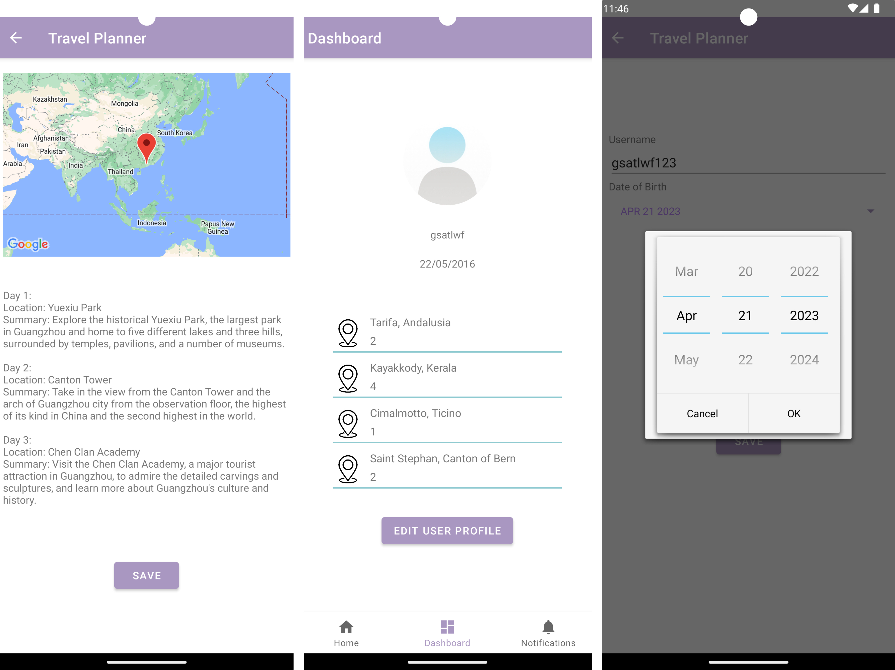

# TravelPlannerApp
The project for OSU CSE5236

### Introduction
This project takes user image as input and detect landmarks within the image, including popular natural and human-made structures. Besides, the color properties of the image will be analyzed and generate a distribution of dominant colors.

### Sample Result

